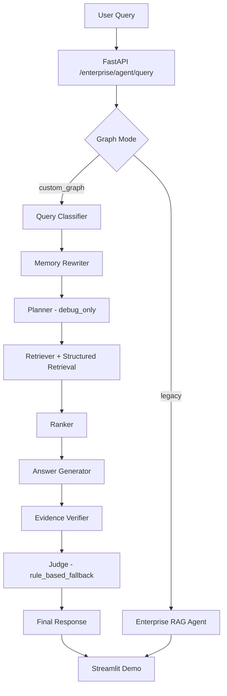

# 企业知识库 Agent + RAG 后端系统

面向企业内部 AI / LLM / Python / 机器学习 / 深度学习等学习资料的智能问答系统。从多格式文档解析、知识库构建、向量检索、结构化检索、多轮会话记忆、证据校验，到自定义 Agent 图编排、系统化评测与可观测性、Streamlit 演示界面——覆盖 RAG 全链路工程实践。

## 项目亮点

1. **完整的数据→检索→回答链路**：文档解析 → chunk → embedding → Chroma 写入 → source tracing → 评测。
2. **结构化检索（Structured Retrieval）**：在密集向量检索基础上引入 metadata/symbol/code 索引，实现对 `source_id`、`doc_type`、API 路径、配置项等精确字段的定向召回。
3. **统一业务接口**：`POST /enterprise/agent/query`，支持 session、top_k、return_sources 等参数。
4. **自定义 Agent 图编排**：`custom_graph` 链路将问答拆分为 query_classifier、memory_rewriter、planner、retriever、ranker、answer_generator、evidence_verifier、judge、final_response 等节点，可独立调试和替换。
5. **可观测性**：graph_debug、nodes_executed、planner_debug、judge_debug、answer_synthesis_profile 全量输出。
6. **多轮会话记忆**：基于 session_id 的 buffer memory，支持上下文改写，无跨 session 泄漏。
7. **系统化评测**：240-case 回归评测、delta-case 差分诊断、bad-case 分类、消融实验、answer/source 对齐分析。
8. **Streamlit 演示界面**：展示 answer、sources、retrieval_debug、memory_debug、verifier_debug、graph_debug。

## 系统架构



- **legacy**：稳定 baseline，使用 LangGraph message-style agent 调用。
- **custom_graph**：typed-state graph 编排，用于节点级可观测和可插拔实验。不声称全面替代 legacy。

## 核心功能

### 知识库构建

- 支持 DOCX、PDF、HTML、Markdown、JSON、YAML 等格式。
- 文档解析为 normalized manifest，再切分为 chunk manifest。
- 每个 chunk 保留 `source_id`、`doc_type`、`section_path`、`title`、`chunk_id`、`hash`、`metadata`。
- 原始正文、模型权重和 Chroma 持久化数据不提交 Git。
- 评测结果只保留短 preview，避免泄露完整知识库内容。

### 检索策略

| 策略 | 描述 |
|------|------|
| Dense Retrieval | SentenceTransformers 嵌入 → Chroma 向量检索 |
| Metadata Retrieval | 按 `source_id`、`doc_type`、`title`、`section_path` 等字段结构化召回 |
| Symbol Retrieval | 提取 API 路径、函数名、配置项、文件名等代码/配置符号索引 |
| Candidate Materialization | 将 dense + structured 候选汇总为统一候选集，按源去重 |
| Ranking | 综合 relevance_score、metadata 命中、keyword 覆盖、source 匹配排序 |
| Source Tracing | 每个回答附带 source cards（source_id、chunk_id、doc_type、score、preview）|

**结构化检索效果**（240-case 固定评测集，DeepSeek）：

| 指标 | baseline (dense only) | 引入结构化检索后 |
|------|----------------------|-----------------|
| calibrated bad_case | 59 | 49 |
| source_hit_rate | 0.694 | 0.751 |
| error | 0 | 0 |

> 说明：结构化检索在固定评测集上有效，但仍有 49 个 calibrated bad cases，检索问题未全部解决。

### Agent 编排

系统保留 `legacy` 作为稳定 baseline，同时实现 `custom_graph` 编排链路：

- **query_classifier**：区分正常、模糊、不支持问题
- **memory_rewriter**：结合 session memory 改写追问
- **planner**：debug-only 计划生成，不改变路由
- **retriever**：执行知识库检索（含 structured retrieval）
- **multi_hop_retriever**：保留能力但默认关闭（实测未证明收益）
- **ranker**：排序候选证据
- **answer_generator**：基于 sources 生成回答
- **evidence_verifier**：检查回答与证据覆盖
- **judge**：rule-based fallback 诊断节点
- **final_response**：统一输出 answer、sources、debug

**custom_graph 不替代 legacy**：两者调用协议不同（message-style vs typed-state），通过 `ENTERPRISE_AGENT_GRAPH_MODE=legacy|custom_graph` 在 endpoint 层切换。

**custom_graph 真实模型 240-case 稳定性**：

| 指标 | legacy | custom_graph |
|------|--------|-------------|
| bad_case_count | 49 | 49 |
| source_hit_rate | 0.751 | 0.746 |
| keyword_hit_rate | 0.981 | 0.986 |
| error | 0 | 0 |
| graph_debug/planner/judge present | — | 240/240 |

> 该结果验证了 custom_graph 在评测集上的稳定性和可观测能力，但不能声称质量全面优于 legacy。

**图编排消融结论**：

| 配置 | multi_hop | judge | planner | calibrated bad | vs legacy |
|------|-----------|-------|---------|---------------|-----------|
| 全开 | on | on | active | 105 | +5 |
| 关 multi-hop | off | on | active | 101 | +4 |
| 全关 | off | off | active | 107 | +7 |
| **当前推荐** | off | on | **debug_only** | 103 | **+1** |

### 多轮记忆

- 基于 `session_id` 的 buffer memory，服务重启后清空。
- 对 follow-up query 做上下文改写。
- 离线 memory eval：24 cases / 47 turns，follow-up context hit rate=1.0，cross-session leak=0。

### 证据校验

- rule-based evidence verifier，不调用真实 LLM。
- 输出 `grounding_score`、`grounding_status`、`citation_coverage`、`matched_terms`、`unsupported_terms`。
- 24 cases 中 expected status match rate=1.0，citation-required cases 3/3 checked。

### 评测与 Bad Case 分析

评测体系包括：

- 240-case 回归评测（legacy vs custom_graph）
- top_k delta matrix（5/8/10）
- answer/source persistence & alignment 诊断
- keyword coverage delta 诊断
- bad-case taxonomy（retrieval_source_miss / doc_type_miss / keyword_miss）

**Bad case 根因分布**（103 个坏例）：

| 类别 | 数量 | 占比 |
|------|------|------|
| doc_type_miss | 72 | ~70% |
| source_miss | 52 | ~50% |
| keyword_miss | 43 | ~42% |

> 主要瓶颈在检索层和数据层（文档类型识别、source 召回、关键词覆盖），而非 Agent prompt 或图编排。因此项目最终未继续扩大 prompt 调优，而是将优化方向收敛到 metadata schema、hybrid retrieval、query-doc_type routing 等检索基础设施。

### Streamlit 演示

- `src/streamlit_app.py`
- 支持输入 query、session_id、top_k
- 展示 answer、source cards、retrieval_debug、memory_debug、verifier_debug、graph_debug、raw response

## 接口示例

**POST /enterprise/agent/query**

```json
{
  "query": "RAG 是什么？",
  "session_id": "demo-session-1",
  "top_k": 5,
  "return_sources": true
}
```

**Response**：

```json
{
  "answer": "RAG (Retrieval-Augmented Generation) 是...",
  "sources": [{
    "source_id": "local_ai_agent_course_pdf",
    "chunk_id": "chunk_norm_pdf_003_0012",
    "doc_type": "pdf",
    "score": 0.85,
    "content_preview": "RAG 的核心理念是..."
  }],
  "retrieval_debug": { "hit_count": 5, "policy_mode": "baseline" },
  "graph_debug": { "graph_mode": "custom_graph", "nodes_executed": ["query_classifier", "retriever"] },
  "latency_ms": 1847,
  "fallback": { "triggered": false, "reason": null },
  "session_id": "demo-session-1"
}
```

## 快速开始

```powershell
# 1. 创建 .env（不要提交）
# USE_FAKE_MODEL=true
# DEFAULT_MODEL=fake

# 2. 启动 legacy 服务
$env:PYTHONPATH = "$PWD\src"
$env:USE_FAKE_MODEL = "true"
$env:ENTERPRISE_AGENT_GRAPH_MODE = "legacy"
python -m uvicorn service.service:app --host 127.0.0.1 --port 8000

# 3. 启动 custom_graph 服务（另一终端）
$env:PYTHONPATH = "$PWD\src"
$env:USE_FAKE_MODEL = "true"
$env:ENTERPRISE_AGENT_GRAPH_MODE = "custom_graph"
$env:ENTERPRISE_MULTI_HOP_MODE = "off"
$env:ENTERPRISE_PLANNER_MODE = "debug_only"
python -m uvicorn service.service:app --host 127.0.0.1 --port 8001

# 4. 健康检查
curl http://127.0.0.1:8000/health

# 5. 运行 smoke 验证
python scripts\smoke_phase7a_default_custom_graph_endpoint.py
python scripts\smoke_phase6j_langgraph.py

# 6. 启动 Streamlit
streamlit run src\streamlit_app.py
```

> 默认使用 fake model，不调用真实 LLM。如需真实模型，配置 `.env` 中的 `DEEPSEEK_API_KEY` 等环境变量并将 `USE_FAKE_MODEL=false`。

## 关键环境变量

| 变量 | 推荐值 | 说明 |
|------|--------|------|
| `USE_FAKE_MODEL` | `true` (demo) | 使用 FakeListChatModel |
| `ENTERPRISE_AGENT_GRAPH_MODE` | `custom_graph` | legacy / custom_graph |
| `ENTERPRISE_MULTI_HOP_MODE` | `off` | 关闭 multi-hop（未证明收益）|
| `ENTERPRISE_PLANNER_MODE` | `debug_only` | 仅记录不改变路由 |
| `ENTERPRISE_JUDGE_MODE` | `rule_based_fallback` | rule-based judge |
| `ENTERPRISE_EVIDENCE_VERIFIER_MODE` | `rule_based` | rule-based evidence check |
| `ENTERPRISE_STRUCTURED_RETRIEVAL_MODE` | `metadata_symbol` | metadata + symbol 索引 |
| `ENTERPRISE_MEMORY_MODE` | `buffer` | session buffer memory |
| `RAG_DEFAULT_TOP_K` | `5` (default) | top_k=10 在 delta 诊断中略优，不声明为生产默认 |
| `CHROMA_PERSIST_DIR` | `./chroma_enterprise` | Chroma 持久化路径 |
| `CHROMA_COLLECTION_NAME` | `enterprise_ai_learning_kb_reviewed` | Chroma collection 名称 |

## 工程验证数据

**结构化检索对比**（DeepSeek 240-case）：

| 指标 | baseline | structured |
|------|----------|-----------|
| calibrated bad_case | 59 | 49 |
| source_hit_rate | 0.694 | 0.751 |
| error | 0 | 0 |

**top_k delta matrix**（20 delta cases）：

| top_k | legacy bad | custom bad | gap | only_custom |
|-------|-----------|-----------|-----|-------------|
| 5 | 12 | 16 | +4 | 5 |
| 8 | 10 | 15 | +5 | 6 |
| 10 | 11 | 12 | +1 | 3 |

**answer/source alignment**（20 delta cases）：

| 发现 | 数量 |
|------|------|
| same_sources_answer_diff | 4 |
| source_order_diff | 0 |
| source_serialization_diff | 0 |
| prompt_profile_diff | 0 |

> 剩余差异更可能来自 answer synthesis / keyword coverage 或 LLM 输出波动，非 source ordering 或 serialization 问题。

## 项目目录结构

```
├── src/
│   ├── service/          # FastAPI 服务入口
│   ├── schema/           # Pydantic 请求/响应模型
│   ├── agents/           # Agent 定义（legacy + custom_graph）
│   ├── rag/              # 检索、配置、planner、judge、verifier、memory
│   └── streamlit_app.py  # Streamlit 演示界面
├── scripts/              # 评测、诊断、构建脚本
├── data/knowledge_base/
│   └── evaluation/       # 评测 cases、results、summaries（sanitized）
├── docs/enterprise_rag_backend/  # 项目技术文档
├── tests/                # pytest (agents + service)
├── .env.example          # 环境变量模板
├── pyproject.toml
├── task.txt              # 开发追踪文档
└── README.md
```

## 项目边界与限制

1. 本项目是**工程原型**，并非生产部署完成品。
2. evidence verifier 是 rule-based baseline，不是事实核查系统。
3. memory 是进程内 buffer，服务重启后清空。
4. Streamlit 是 demo UI，不含认证、权限、审计。
5. custom_graph 主要价值是可观测和可插拔，**不代表全面优于 legacy**。
6. 当前 bad case 主要来自 `doc_type_miss`、`source_miss`、`keyword_miss`——检索和数据层的改进空间大于 prompt 调参。

## 后续规划

1. **Demo Query Set**：整理可用于演示的稳定查询集。
2. **query-doc_type routing**：根据查询类型选择最佳检索策略。
3. **hybrid retrieval**：dense + sparse + metadata 融合。
4. **alias dictionary**：建立术语别名映射提升 keyword 覆盖。
5. **source rerank**：基于 source 级别特征的重排序。
6. **persistent memory**：跨会话持久化记忆。
7. **claim-level verifier**：更细粒度的声明级证据校验。

## 贡献边界

本项目基于开源 [agent-service-toolkit](https://github.com/piao666/agent-service-toolkit) 扩展。上游提供 FastAPI、LangGraph service skeleton、多 Agent 接口、streaming 等基础能力。本项目在基础框架之上新增并验证了：企业知识库 RAG pipeline、多格式 corpus 处理、chunk/source tracing、结构化检索（metadata + symbol）、系统化评测体系、多轮 memory、evidence verifier、custom graph endpoint routing、graph_debug 可观测性以及 Streamlit demo。
