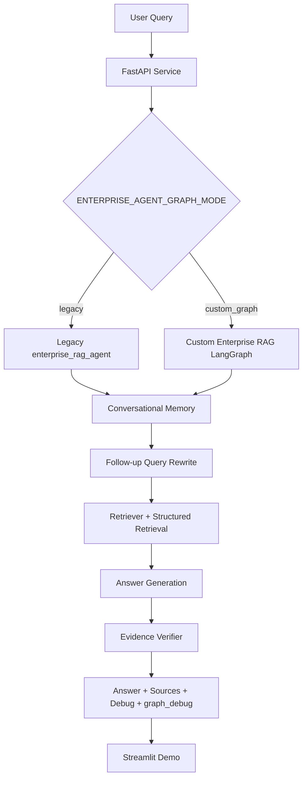
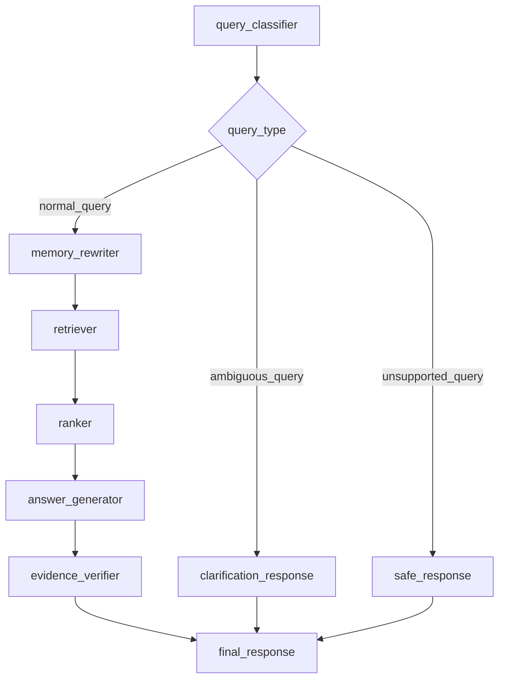

# Enterprise Knowledge Base Agent + RAG Backend

基于开源 `agent-service-toolkit` 扩展的企业知识库 Agent + RAG 后端项目。项目保留上游 FastAPI、LangGraph、多 Agent registry、流式接口与反馈机制，并补充了可复现的知识库处理、结构化检索、评测体系、多轮会话记忆、证据校验、自定义 LangGraph 编排和 Streamlit 演示界面。

> 本仓库展示的是经过本地与受控环境验证的工程原型，不代表生产部署完成，也不声称消除了全部检索坏例或模型幻觉。

## Project Overview / 项目简介

项目围绕统一业务接口 `POST /enterprise/agent/query` 构建完整问答链路。接口接收问题、会话标识和检索参数，返回 answer、可追踪 sources、检索调试信息、会话记忆信息以及可选证据校验结果。原有 `/health`、`/info`、`/invoke`、`/{agent_id}/invoke`、`/stream`、`/{agent_id}/stream`、`/history` 与 `/feedback` 接口继续保留。

## Why This Project / 项目背景

普通 RAG demo 往往只验证“能检索、能生成”，但企业知识库场景还需要回答：

- 文档如何受控采集、解析、规范化和切分？
- 检索结果能否追踪到 source、section 和 chunk？
- dense retrieval 对 metadata、API/config symbol 等精确查询是否足够？
- 多轮追问如何绑定 session，且避免跨 session 污染？
- 回答是否被返回证据支持，低置信度时如何暴露风险？
- 评测结果如何复现，失败边界如何诚实记录？

本项目将这些问题拆成独立模块和阶段性评测，而不是只包装一次模型调用。

## Key Features / 核心功能

- **FastAPI + Agent registry**：保留上游通用 Agent 服务能力，注册 `enterprise-rag-agent`。
- **统一业务 API**：提供 `/enterprise/agent/query`，返回 answer、sources 和多类 debug 信息。
- **多格式知识库流程**：覆盖 DOCX、PDF、HTML、Markdown、JSON、YAML 等受控样本。
- **本地 embedding 默认路线**：避免默认将私有知识库正文发送给第三方 embedding API。
- **Chroma + source tracing**：返回 source、title、chunk id、score、metadata 和短 preview。
- **Structured Retrieval**：使用 metadata index、symbol index 和 candidate materialization。
- **系统化评测**：覆盖 240-case、embedding/reranker/chunking 对比及 bad-case analysis。
- **Conversational Memory**：按 `session_id` 隔离的短期 buffer 与 follow-up rewrite。
- **Evidence Grounding**：rule-based verifier 输出 grounding status、coverage 和 unsupported terms。
- **Custom LangGraph Graph**：显式编排分类、记忆、检索、排序、生成和证据校验。
- **Custom Graph Endpoint Routing**：通过 `ENTERPRISE_AGENT_GRAPH_MODE` 在 `/enterprise/agent/query` 内切换 `legacy` 与 `custom_graph` 两条链路，避免强行混用 message-style 与 typed-state graph 协议。
- **Streamlit Demo**：展示 answer、source cards 及 retrieval/memory/verifier/graph debug。

## System Architecture / 系统架构



| Capability | Feature flag | Default |
| --- | --- | --- |
| Conversational memory | `ENTERPRISE_MEMORY_MODE=off|buffer` | `off` |
| Structured retrieval | `ENTERPRISE_STRUCTURED_RETRIEVAL_MODE=off|metadata_symbol` | `off` |
| Evidence verifier | `ENTERPRISE_EVIDENCE_VERIFIER_MODE=off|rule_based` | `off` |
| Agent graph | `ENTERPRISE_AGENT_GRAPH_MODE=legacy|custom_graph` | `legacy` |

## RAG Pipeline

```text
source catalog
  -> controlled sample acquisition
  -> multi-format parsing
  -> normalized manifest
  -> chunk manifest
  -> local embedding
  -> Chroma collection
  -> retrieval payload
  -> answer synthesis
  -> source tracing
```

Manifest 固化来源、hash、解析状态、chunk metadata 和 review 状态。原始正文缓存、normalized/chunk 正文、本地模型与 Chroma 数据库不进入 Git。检索输出只保留短 preview，避免在日志和评测产物中复制完整文档正文。

典型检索记录：

```json
{
  "source_id": "domain_docs",
  "title": "Document Title",
  "doc_type": "html",
  "section_path": "Guide / Request Body",
  "source_url": "https://example.invalid/docs/page",
  "chunk_id": "stable_chunk_id",
  "content_preview": "Short, display-safe preview",
  "relevance_score": 0.82,
  "metadata": {}
}
```

## Structured Retrieval

纯 dense retrieval 对 `source_id`、标题、配置项、API path 和代码 symbol 等精确查询存在边界。Phase 6F 增加 metadata index、code/config symbol index、structured retrieval probe、candidate materialization 以及 API-level failure-boundary analysis。

当前最佳测量版本为 **Phase 6F-8 structured materialization**：

| Metric | Baseline | Phase 6F-8 |
| --- | ---: | ---: |
| 240-case calibrated `bad_case_count` | 59 | 49 |
| `source_hit_rate` | 0.694 | 0.751 |
| `error_count` | 0 | 0 |
| `timeout_count` | 0 | 0 |

该结果说明 structured materialization 在固定 240-case 评测中降低了 calibrated bad cases 并提升 source hit；仍有 49 个 calibrated bad cases，不能解释为检索问题已全部解决。

## Evaluation System

评测体系覆盖 query type、source hit、keyword hit、citation、fallback、latency 和 root cause：

- 240-case API/Agent evaluation；
- embedding model benchmark；
- hybrid retrieval、reranker 与 chunking ablation；
- query-type-aware policy 的正向和负向实验；
- calibrated bad-case taxonomy；
- structured retrieval materialization 对比；
- memory、evidence verifier 和 custom graph smoke。

评测文件位于 `data/knowledge_base/evaluation/`，阶段结论位于 `docs/enterprise_rag_backend/`。被跳过的检查明确记录为 skipped，不写成 passed。

## Conversational Memory

Phase 6G 提供进程内、按 `session_id` 隔离的短期 memory buffer：保存最近问答与 source metadata 摘要，识别依赖上下文的追问，并通过 deterministic rule 生成 `contextual_query`。无 session、memory off 或无历史时保持 no-op，不保存完整 retrieved chunk 正文。

| Evaluation | Result |
| --- | --- |
| Offline memory eval | 24 cases / 47 turns |
| Follow-up context hit rate | 1.0 |
| Cross-session leak | 0 |
| API-level eval | 12 requests |
| Response schema valid | 12/12 |
| API errors / timeouts | 0 / 0 |

`memory_debug` 展示 turn count、`is_follow_up`、`contextual_query` 和 rewrite strategy。

## Evidence Grounding / Citation Verifier

Phase 6I 增加默认关闭的 rule-based evidence verifier。它比较 query、answer 与 source summary 中的重要 term，输出 `grounding_score`、`grounding_status`、`citation_coverage`、`matched_terms`、`unsupported_terms`、`safe_fallback_triggered` 和 `verifier_debug`。

| Metric | Result |
| --- | ---: |
| Evidence cases | 24 |
| Expected status match rate | 1.0 |
| Citation-required cases checked | 3/3 |
| Unsupported answers detected | 2/2 |
| `calls_llm` | false |
| `writes_chroma` | false |

该 verifier 是低成本 baseline，只用于暴露证据覆盖风险，不能证明答案中的每个事实都正确。

## Custom LangGraph Agent Graph

Phase 6J 实现可独立 import 和 smoke 的 custom graph。默认 API 仍使用 `legacy`，避免影响既有行为。

`legacy enterprise-rag-agent` 与 `custom_graph` 使用不同 state/call protocol。`legacy` 走 message-style Agent invocation，`custom_graph` 使用 `EnterpriseRAGGraphState` TypedDict 和 `final_response` 输出。因此项目没有把 `custom_graph` 强行注册成 `enterprise-rag-agent`，而是在 `/enterprise/agent/query` 内通过 `ENTERPRISE_AGENT_GRAPH_MODE` 做 endpoint-level routing。

Phase 6L 之后，`custom_graph` 已支持 async LangGraph nodes、`compiled_graph.ainvoke(...)`、基于 `get_model(...).ainvoke(...)` 的 answer node、模型失败时的 safe fallback，以及顶层 `graph_debug` / `nodes_executed` 可观测性。



节点包括 `query_classifier`、`memory_rewriter`、`retriever`、`ranker`、`answer_generator`、`evidence_verifier`、`clarification_response`、`safe_response` 和 `final_response`。详细图见 [`agent_graph_mermaid.md`](docs/enterprise_rag_backend/agent_graph_mermaid.md)。

```text
graph_import_ok=true
graph_build_ok=true
semantic_route_ok=true
ambiguous_route_ok=true
unsupported_route_ok=true
calls_llm=false
writes_chroma=false
```

Phase 6L dual-service comparison 在 fake model 环境下进一步验证了 endpoint routing：`legacy` 与 `custom_graph` 两个独立 FastAPI 实例都能稳定返回 24/24 `status_ok` 和 24/24 `schema_valid`；`custom_graph` 额外返回 24/24 顶层 `graph_debug`，其中 `graph_mode=custom_graph`，`nodes_executed_count=7`。

## Streamlit Demo

`src/streamlit_app.py` 提供聊天界面，可配置 API base URL、endpoint、session 和 top-k，展示 Agent answer、expandable source cards、`retrieval_debug`、`memory_debug`、`verifier_debug`、独立的 `graph_debug` 面板、request payload 和 raw response。API 不可用或超时时会显示友好错误；前端不读取、保存或展示 provider API key。

前端开关不能修改已启动后端进程的环境变量。实际 memory、structured retrieval、verifier 和 graph mode 由服务启动环境决定。

## HPC Revalidation

Phase 6K preflight 在受控 HPC 环境完成轻量复验：Phase 6G memory、Phase 6I evidence verifier 与 Phase 6J custom graph smoke 均通过；未调用真实 LLM、未写 Chroma、未运行 240-case，也未运行 embedding/reranker benchmark。

兼容性记录：该环境的 agent tests 为 `7 passed`；service tests 为 `11 passed, 1 compatibility error`，错误位于 `/info` 相关 LangGraph compatibility path。因此 preflight 不能表述为所有环境完全无差异。

## How to Run

### 配置与启动 FastAPI

```powershell
cd <PROJECT_ROOT>
Copy-Item .env.example .env
# 按需填写本地开发配置；不要提交 .env。
$env:PYTHONPATH = "$PWD\src"
$env:USE_FAKE_MODEL = "true"
$env:ENTERPRISE_MEMORY_MODE = "buffer"
$env:ENTERPRISE_STRUCTURED_RETRIEVAL_MODE = "metadata_symbol"
$env:ENTERPRISE_EVIDENCE_VERIFIER_MODE = "rule_based"
$env:ENTERPRISE_AGENT_GRAPH_MODE = "legacy"
.\.venv\Scripts\python.exe -m uvicorn service.service:app --host 127.0.0.1 --port 8000
```

### 启动 custom_graph 路径

```powershell
cd <PROJECT_ROOT>
$env:PYTHONPATH = "$PWD\src"
$env:USE_FAKE_MODEL = "true"
$env:ENTERPRISE_MEMORY_MODE = "buffer"
$env:ENTERPRISE_STRUCTURED_RETRIEVAL_MODE = "metadata_symbol"
$env:ENTERPRISE_EVIDENCE_VERIFIER_MODE = "rule_based"
$env:ENTERPRISE_AGENT_GRAPH_MODE = "custom_graph"
.\.venv\Scripts\python.exe -m uvicorn service.service:app --host 127.0.0.1 --port 8000
```

健康检查：

```powershell
curl http://127.0.0.1:8000/health
```

### 启动 Streamlit

```powershell
cd <PROJECT_ROOT>
.\.venv\Scripts\python.exe -m streamlit run src\streamlit_app.py
```

### 核心 smoke/eval

```powershell
.\.venv\Scripts\python.exe scripts\smoke_phase6g_memory.py
.\.venv\Scripts\python.exe scripts\run_phase6i_evidence_eval.py
.\.venv\Scripts\python.exe scripts\smoke_phase6j_langgraph.py
```

需要本地 embedding 或 Chroma 的命令应使用 `.env.example` 中的通用变量和 `<LOCAL_EMBEDDING_MODEL_PATH>`、`<RUNTIME_CHROMA_DIR>` 等占位配置。

## Demo Walkthrough

### Demo 1：普通 RAG 问答

```text
问题：RAG 是什么？
观察：answer、sources、retrieval_debug。
```

### Demo 2：多轮 memory

```text
问题 1：RAG 是什么？
问题 2：它有什么局限？
问题 3：那它适合什么场景？
观察：memory_debug 中 original_query -> contextual_query 的改写及 turn count。
```

### Demo 3：Evidence verifier

设置 `ENTERPRISE_EVIDENCE_VERIFIER_MODE=rule_based`，观察 `verifier_debug` 中的 `grounding_score`、`grounding_status`、`citation_coverage` 和 `unsupported_terms`。

### Demo 4：Custom graph smoke

```powershell
.\.venv\Scripts\python.exe scripts\smoke_phase6j_langgraph.py
```

观察 `graph_import_ok`、`graph_build_ok`、`semantic_route_ok`、`ambiguous_route_ok` 和 `unsupported_route_ok` 均为 `true`。

### Demo 5：Custom Graph Endpoint Routing

```text
1. 启动服务时设置 ENTERPRISE_AGENT_GRAPH_MODE=custom_graph。
2. 访问 Streamlit 或直接请求 /enterprise/agent/query。
3. 观察 response 中的 graph_debug：
   - graph_mode = custom_graph
   - nodes_executed 非空
   - route / verifier_debug 可用于排查执行链路
```

## Key Results

| Area | Measured result |
| --- | --- |
| Structured retrieval | 240-case calibrated bad cases 59 -> 49 |
| Structured retrieval | source hit rate 0.694 -> 0.751 |
| Structured retrieval runtime | 0 errors, 0 timeouts |
| Memory offline eval | 24 cases, 47 turns, context hit 1.0, cross-session leak 0 |
| Memory API eval | 12 requests, schema valid 12/12, 0 errors, 0 timeouts |
| Evidence eval | 24 cases, expected status match 1.0 |
| Evidence citation checks | 3/3 checked; unsupported answers 2/2 detected |
| Custom graph smoke | import/build/semantic/ambiguous/unsupported routes passed |

Phase 6L Dual-Service Endpoint Comparison:
- legacy service and custom_graph service were launched as two independent FastAPI instances.
- legacy endpoint: 24/24 status_ok, 24/24 schema_valid, error=0, timeout=0.
- custom_graph endpoint: 24/24 status_ok, 24/24 schema_valid, error=0, timeout=0.
- custom_graph graph_debug_present: 24/24.
- custom_graph graph_debug.graph_mode: custom_graph.
- custom_graph nodes_executed_count: 7.
- services were cleaned up after evaluation.
- calls_real_llm=false, writes_chroma=false, runs_240_case=false, runs_benchmark=false.

Phase 6L 证明两条 endpoint 链路在 fake model representative cases 下均可稳定响应，并验证 `custom_graph` 的 `graph_debug` 可观测性已经闭环。

Phase 6L dual-service comparison validates endpoint routing, schema stability, and `graph_debug`
observability under fake model mode. It does not evaluate real LLM answer quality.

Phase 6M-2 DeepSeek Representative Evaluation:
- Ran 8 representative cases under `custom_graph` endpoint mode.
- Compared fake model and real DeepSeek responses.
- fake: 8/8 `answer_non_empty`, 8/8 `graph_debug_present`, 8/8 `verifier_debug_present`, `error=0`, `timeout=0`.
- DeepSeek: 8/8 `answer_non_empty`, 8/8 `graph_debug_present`, 8/8 `verifier_debug_present`, `error=0`, `timeout=0`.
- `calls_real_llm=true` for the DeepSeek run.
- `writes_chroma=false`, `runs_240_case=false`, `runs_benchmark=false`.
- No unsupported answer was observed in this representative run.

This is a small representative real-LLM sanity check, not a full benchmark or 240-case evaluation.

这些指标对应固定版本、固定样本和明确评测方法，不外推为生产准确率或通用 benchmark 结论。

## Contribution Boundary

本项目在通用 `agent-service-toolkit` Agent service skeleton 基础上进行企业知识库 Agent + RAG 系统扩展。基础框架提供 FastAPI、LangGraph service skeleton、多 Agent 接口、streaming 和通用客户端等能力；本项目重点实现和验证了企业知识库 RAG pipeline、受控多格式 corpus、chunk/source tracing、structured retrieval materialization、240-case 评测体系、conversational memory、evidence grounding verifier、custom LangGraph graph 与 Streamlit demo。

`custom_graph` endpoint routing、`graph_debug` observability 和 dual-service comparison 也是本项目在通用 service skeleton 之上的新增工程能力。

该边界既不把上游框架能力归为本项目原创，也不把本项目简化为仅修改模板配置。

## Limitations and Future Work

1. Evidence verifier 是 rule-based baseline，不是生产级事实核查或 claim-level verification。
2. Memory 是进程内 buffer，服务重启后清空，且不支持跨进程共享。
3. `custom_graph` 当前主要用于独立 smoke 与图结构展示；默认 API 仍走 `legacy`。
4. Streamlit 是 demo UI，不具备生产级认证、权限、审计和部署能力。
5. HPC preflight 是轻量复验，未运行 240-case 或 benchmark，并保留一项 service compatibility note。
6. Phase 6F-8 仍有 49 个 calibrated bad cases，metadata lookup、code/config 和 evidence filtering 仍可改进。
7. Phase 6L dual-service comparison 使用 fake model 和 representative cases，验证的是 endpoint routing、schema stability、graph_debug observability 和服务稳定性，不代表真实 LLM answer quality，也没有重新运行 240-case。
8. Phase 6M-2 使用真实 DeepSeek 跑了 8 条 representative cases，验证了 real-LLM 路径下 `custom_graph`、`graph_debug` 和 `verifier_debug` 的保留，但这不替代 240-case 评测、成本分析、吞吐 benchmark 或生产事实性评估。
9. 后续仍可继续进行 custom_graph 全量 240-case endpoint evaluation、persistent memory backend、claim-level evidence verifier 与 real-LLM latency/cost benchmark。

## Repository Structure

```text
src/service/                         FastAPI 服务、通用接口与业务查询 endpoint
src/schema/                          API 请求/响应 schema
src/agents/                          Agent registry、enterprise RAG agent 与 custom graph
src/rag/                             loader、embedding、retrieval、memory、structured retrieval、verifier
src/streamlit_app.py                 RAG / memory / verifier 演示界面
scripts/                             ingestion、probe、evaluation 与 smoke 脚本
data/knowledge_base/evaluation/      可复现评测 case、result 与 summary
docs/enterprise_rag_backend/         架构、阶段设计、评测结论与已知限制
tests/                               上游与扩展能力的自动化测试
.env.example                         安全环境变量示例，不包含真实凭据
task.txt                             阶段计划、checkpoint 和实测结果记录
```

更详细的阶段设计与验证记录见 [`docs/enterprise_rag_backend/`](docs/enterprise_rag_backend/)。

## License

本项目沿用上游仓库的开源许可证，详见 [LICENSE](LICENSE)。
