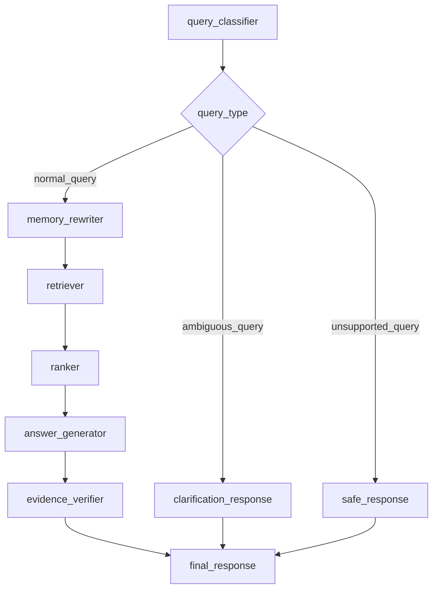

# Enterprise RAG Agent Graph

The normal route covers semantic, metadata, code/API, citation-required, and session-scoped
follow-up queries. The graph is optional; `ENTERPRISE_AGENT_GRAPH_MODE=legacy` remains the default.
